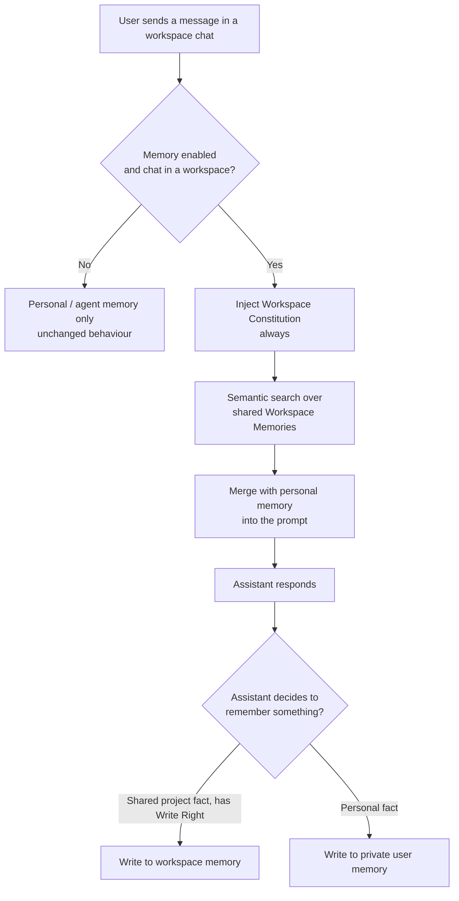

# Workspace Memory Architecture

## Overview

**Workspace Memory** adds a third memory scope to the PrimeThink memory system, alongside the two existing scopes:

| Scope | Belongs to | Visible to |
|-------|-----------|-----------|
| **User (global)** | a single user | that user, across every agent |
| **Agent** | a single user + a specific agent | that user, only through that agent |
| **Workspace** *(new)* | a [shared workspace](/Collaboration/#shared-workspaces) | **every member of the workspace** |

The goal is a **shared team brain**. Without it, two problems exist:

1. **Cross-project leakage** — a fact taught inside one project becomes a user-global memory and resurfaces in unrelated chats.
2. **No shared knowledge** — when a workspace is shared across several people, each member's assistant learns project facts independently and nothing is shared.

Workspace memory is keyed to the workspace and shared across all of its members, so the whole team benefits from the same learned project knowledge and rules, without polluting anyone's personal memory.

The feature is **additive**. Existing user and agent memory behave exactly as before, and no existing memory needs to change. It reuses the same tool-driven model described in the [Memory guide](/Memory/): the assistant decides when to remember and recall through its `search_memory` and `update_memory` tools — there is no background extraction process.

---

## When workspace memory is active

Workspace memory engages only when **all** of the following are true for a chat:

1. Memory is enabled for the chat (the assistant has the `MEMORY` [capability](/admin/Capabilities/) and the chat has memory turned on).
2. The chat belongs to a **workspace** (it lives inside a workspace container rather than being a standalone chat).
3. The chat is **not** a temporary chat.

When a chat does **not** belong to a workspace, none of the workspace behaviour runs and memory works exactly as it does today — pure personal/agent memory, with no behavioural change. This fallback is silent and never produces an error.

---

## Memory types

Workspace memory introduces two new memory types, mirroring the personal *Constitution* / *Other Important Memories* split:

| Type | Purpose | Loaded into the prompt? |
|------|---------|-------------------------|
| `workspace_constitution` | Behaviour rules every member's assistant must follow inside the workspace | **Always**, when the chat is in a workspace |
| `workspace_memory` | Shared project facts and context | On demand, via semantic search |

Both types are **agent-agnostic** — they are shared no matter which agent a member uses inside the workspace.

### Attribution vs. scope

A workspace memory records **who authored it** for attribution only. Its *scope* — who can see and use it — is the workspace, not the author. Any member sees every workspace memory regardless of which member created it.

---

## Permissions

### Reading

Read access is **implied by membership**. If a user can open a chat that belongs to a workspace, that user is a member of the workspace and may read its workspace memory. There is no separate read check.

### Writing (Write Right)

The right to **add, update, or delete** workspace memory follows the workspace's `share_type` (see [Shared Workspaces](/Collaboration/#shared-workspaces)):

| Workspace share type | Who can write workspace memory |
|----------------------|--------------------------------|
| `Shared` | **Every member** |
| `Owner Only` | The workspace creator only |
| `View Only` | The workspace creator only |
| `Not Shared` | The workspace creator only |

The rule is simple: in a fully `Shared` workspace, ownership is dissolved and everyone is equal, so everyone can curate the shared brain. In every other case, only the creator can change it, while other members can still read it.

When a member lacks Write Right:

* The workspace memory types are **not offered** to that member's assistant, so it will not attempt to write them.
* Any add / update / delete of a workspace memory is **rejected** without modifying anything.

### Ownership checks on update and delete

When the assistant updates or deletes a workspace memory, the system verifies that:

* the memory actually belongs to the **current** workspace, and
* the acting member holds **Write Right**.

If either check fails, the operation returns a not-found / not-permitted result and **no change is made**. This prevents a chat in one workspace from reaching into another workspace's memory.

---

## Retrieval and prompt injection

When a chat belongs to a workspace and memory is enabled:

1. **Workspace Constitution** memories are **always** injected into the assistant's system prompt, so the team's rules are in force from the first message.
2. The user's query is run through a **semantic search** over the workspace's shared knowledge, and relevant hits are injected.

Workspace memories appear in their own clearly labelled blocks, kept distinct from personal memory blocks, and their text is escaped so stored content cannot break out of its block in the prompt. From the assistant's side, calling `search_memory` inside a workspace transparently returns matches from **both** the user scope and the workspace scope, merged into one result set.

---

## Routing: how a write lands in the right scope

The scope of a write is determined by the **memory type** the assistant chooses:

* A **workspace type** (`workspace_constitution` / `workspace_memory`) routes the write to the workspace's shared memory — but only if the member holds Write Right. Otherwise the write is refused.
* A **personal type** routes to the user's private memory exactly as before.

For updates and deletes, routing is decided by the **stored** memory: if the target memory is a workspace memory, the workspace ownership and Write Right checks apply; otherwise the usual personal/agent checks apply.

This is why the leakage safeguard matters: the **type descriptions** the assistant reads explicitly state that workspace types are shared with everyone and that personal facts must stay in private memory. This guidance — not a structural barrier — is the primary control that keeps personal information out of the shared scope, exactly as agent-scoped rules are kept distinct from user-wide rules today.

---

## Lifecycle and maintenance

* **Deletion** — when a workspace is deleted, its workspace memories are removed with it, and the shared knowledge store for that workspace is cleared so no orphaned data remains.
* **Reindexing** — a workspace's shared knowledge can be rebuilt from its stored memories if search results ever drift, mirroring the personal-memory reindex described in the [Memory guide](/Memory/#viewing-and-managing-memories).

---

## Tenant isolation

Workspace memory preserves PrimeThink's hard tenant boundary: shared knowledge is always partitioned by both the workspace **and** the owning [Group (Organization)](/admin/Group-Management/). No memory is ever readable across organizations.

---

## Summary

* Workspace memory is a **third scope** — shared across all members of a workspace — added without touching personal or agent memory.
* It uses **two new types**: `workspace_constitution` (always injected) and `workspace_memory` (semantic recall).
* **Read** access follows membership; **write** access follows the workspace `share_type` (everyone in `Shared`, creator-only otherwise).
* Personal information is kept out of the shared scope by the instructions the assistant follows, the same way agent rules are kept separate from user rules.

See also: [Memory](/Memory/) · [Collaboration](/Collaboration/) · [Roles and Permissions](/admin/Roles-and-Permissions/)
